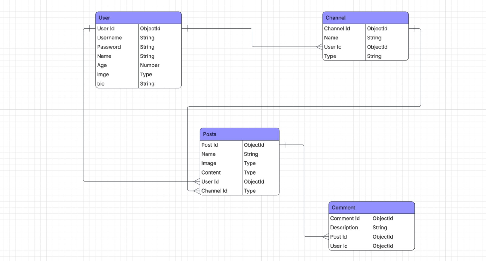

 # MotivHub
### “Stay motivated. Grow together.”
A goal-driven social platform where users support one another through shared progress and encouragement.

## ✨ Overview

**MotivHub** is a community-based application built around channels, each focused on a specific personal goal such as fitness, studying, saving money, or any other self-improvement objective.
Users join channels that align with their goals and share p||"""osts, including written updates or images"", to document their journey. Members within the same channel motivate one another, exchange advice, and provide support—turning each channel into a focused, encouraging community.

## 🌟 Features

### 🎯 Goal-Focused Channels
Each channel is dedicated to a specific goal.
Channels act as small communities centered around shared commitment.

### 📝 Progress Sharing
Users can create posts inside channels.
Posts may include written updates or images to track progress.
Members can view and engage with each other’s posts.

### 💬 Community Interaction
Users can comment on posts.
Encourage, advise, and support others within the same channel.
Foster accountability

### 🔐 Authentication & Security
User authentication with JSON Web Tokens (JWT).
Protected routes for creating, updating, and deleting content.
Only authorized users can modify their own data.

## 🛠️ Tech Stack

**Backend** : Node.js

**Framework** : Express.js

**Database** : MangoDB

## Figme link
- https://www.figma.com/site/4Tuzg36tcn8dLm5cvchOJW/Untitled?node-id=0-1&t=Q3PUI9CPJJL15XGt-1

## 🧩 ERD (Entity Relationship Diagram)

## 🔮 Future Improvements

- Private messaging between users